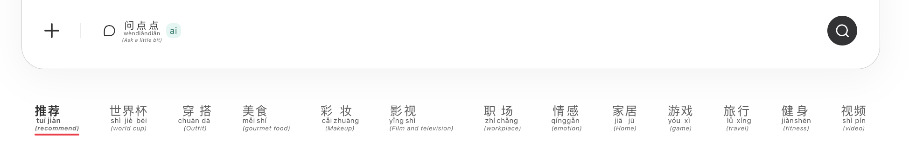
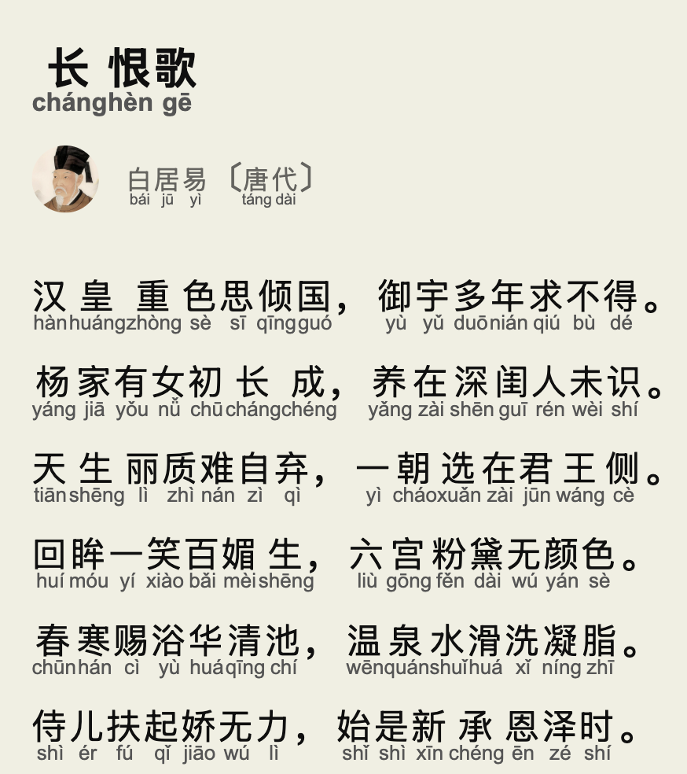
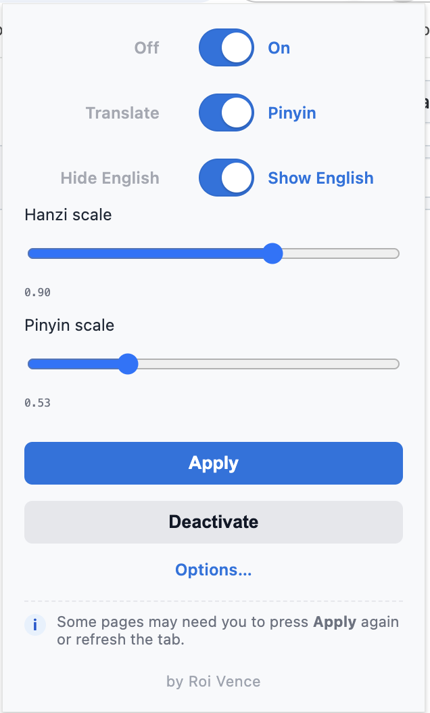

# Pinyinizer

A Chrome extension that translates any web page **without breaking it**. The
text changes, everything else — images, buttons, layout — stays exactly where it
was. One click puts the original back.

It can also add **pinyin** below Chinese text, which makes it handy if you're
learning the language.

<p align="center">
  
</p>

<p align="center">
  
  
</p>

---

## Install

There's no download or build step — it runs straight from this folder.

1. Open `chrome://extensions` in Chrome
2. Turn on **Developer mode** (top right)
3. Click **Load unpacked** and pick this folder

That's it. The Clean Translate icon appears in your toolbar.

---

## Using it

Click the toolbar icon and choose a mode:

- **Translate** — rewrites the page in your language. Works on sites that load
  content as you scroll, too. Click **Undo** to get the original back.
- **Pinyin** — puts pinyin above each Chinese character, with an optional
  English gloss under each sentence. A second toggle switches to **Accents
  only**: each character gets just its tone mark (ˉ ˊ ˇ ˋ, and nothing for the
  neutral tone), sitting just above the character in a small blue box so it
  never reads as one of its strokes. Handy for practising tones without reading
  the whole syllable — and the page barely changes width.
- **Captions** (experimental) — translates subtitles on `<video>` players as
  they play.

---

## Choosing a translator

Open **Options** to pick where translations come from. Every option has a
**Test** button, so you can check it works before saving.

**Just want it to work?** Pick **Google Translate (free)**. No setup, no account,
no API key. (It doesn't work from mainland China.)

**Want nothing to leave your computer?** Pick **Local LLM** — see the section
below.

**In mainland China?** Use **Baidu** or **Youdao**. Both need a free account and
take about two minutes to set up.

The other choices — Google Cloud, NLLB, LibreTranslate — are there if you
already run one of them or need something more reliable at scale.

<p align="center">
  
</p>

---

## Fully private translation (optional)

If you'd rather no website ever sees the pages you read, run the translator on
your own machine. The easiest way is [Ollama](https://ollama.com):

```bash
ollama pull qwen2.5:1.5b-instruct
OLLAMA_ORIGINS="chrome-extension://*" ollama serve
```

Then in **Options**, choose **Local LLM** and click **Test**. The defaults are
already filled in.

The `OLLAMA_ORIGINS` line is needed because Chrome extensions count as an
outside app, and Ollama blocks those by default.

LM Studio and llama.cpp work too — just change the address to
`http://127.0.0.1:1234` or `http://127.0.0.1:8080`.

---

## Privacy

- Your API keys stay on your computer and are never sent anywhere except to the
  service they belong to.
- Translations are kept in memory only and disappear when you close Chrome.
  Nothing you read is written to disk.
- If you use a cloud translator, that company sees the text being translated —
  that's unavoidable. Use **Local LLM** or **NLLB** if that matters to you.

---

## For developers

```bash
node --test tests/*.test.js     # unit tests
bash scripts/check-syntax.sh    # syntax check all first-party JS
```

- [Architecture and message protocol](docs/ARCHITECTURE.md)
- [Real-time translation roadmap](docs/ROADMAP.md)
